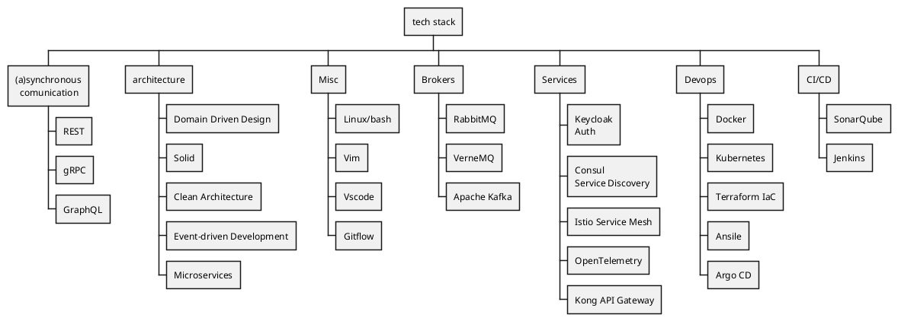

## Architecture

```plantuml
@startwbs
* tech stack
** (a)synchronous\n  comunication
*** REST
*** gRPC
*** GraphQL
** architecture
*** Domain Driven Design
*** Solid
*** Clean Architecture
*** Event-driven Development
*** Microservices

** Misc
*** Linux/bash
*** Vim
*** Vscode
*** Gitflow

** Brokers
*** RabbitMQ
*** VerneMQ
*** Apache Kafka

** Services
*** Keycloak\nAuth
*** Consul\nService Discovery
*** Istio Service Mesh
*** OpenTelemetry
*** Kong API Gateway

** Devops
*** Docker
*** Kubernetes
*** Terraform IaC
*** Ansile
*** Argo CD

** CI/CD
*** SonarQube
*** Jenkins

@endwbs
```

