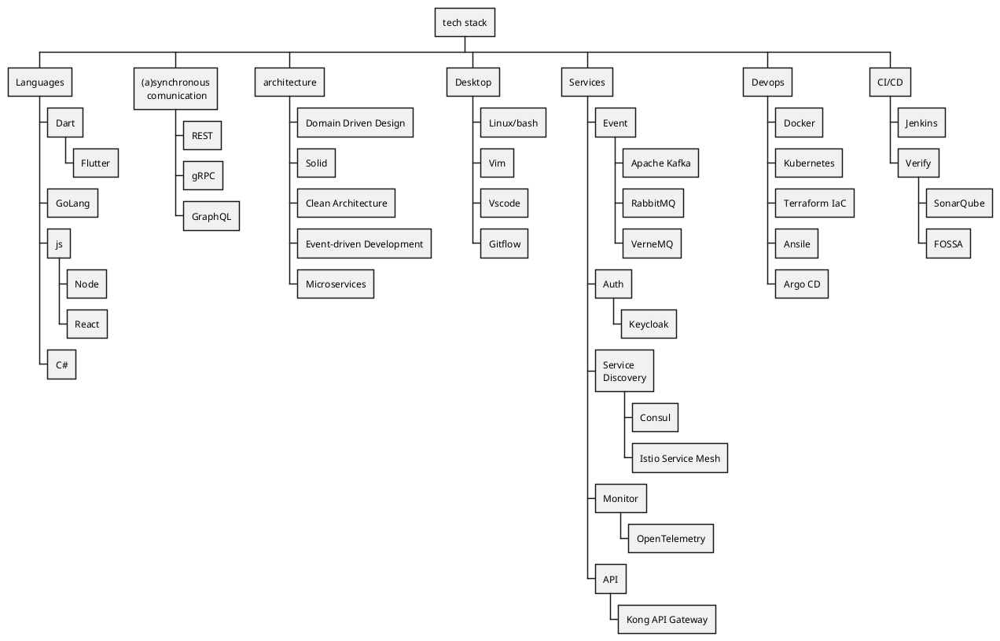

## sw tech stack

```plantuml
@startwbs
* tech stack

** Languages
*** Dart
**** Flutter
*** GoLang
*** js
**** Node
**** React
*** C#


** (a)synchronous\n  comunication
*** REST
*** gRPC
*** GraphQL

** architecture
*** Domain Driven Design
*** Solid
*** Clean Architecture
*** Event-driven Development
*** Microservices

** Desktop
*** Linux/bash
*** Vim
*** Vscode
*** Gitflow

** Services
*** Event
**** Apache Kafka
**** RabbitMQ
**** VerneMQ
*** Auth
**** Keycloak
*** Service\nDiscovery
**** Consul
**** Istio Service Mesh
*** Monitor
**** OpenTelemetry
*** API
**** Kong API Gateway

** Devops
*** Docker
*** Kubernetes
*** Terraform IaC
*** Ansile
*** Argo CD

** CI/CD
*** Jenkins
*** Verify
**** SonarQube
**** FOSSA

@endwbs
```

